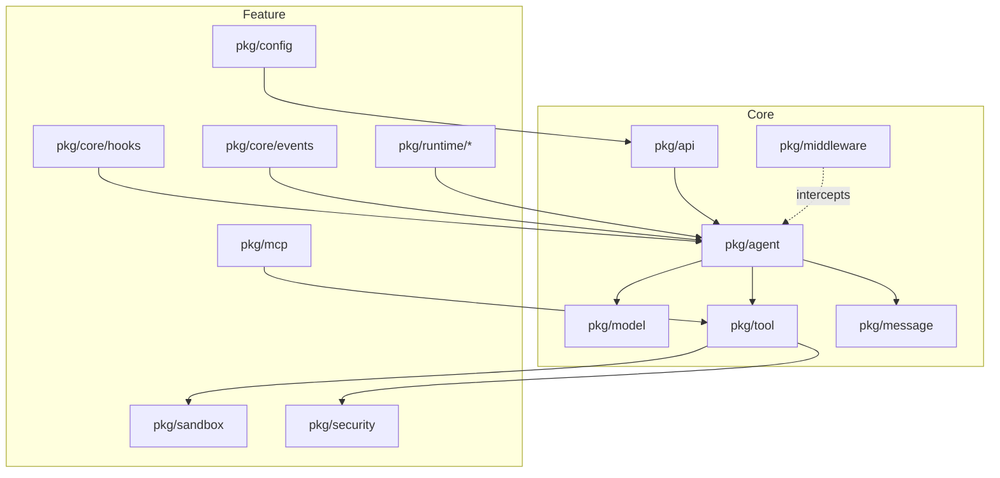

[中文](README_zh.md) | English

# agentsdk-go

An Agent SDK implemented in Go that implements core Claude Code-style runtime capabilities, plus an optional middleware interception layer.

## Overview

agentsdk-go is a modular agent development framework that implements core Claude Code-style runtime capabilities (Hooks, MCP, Sandbox, Skills, Subagents, Commands, Tasks) and optionally exposes a six-point middleware interception mechanism. The SDK supports deployment scenarios across CLI, CI/CD, and enterprise platforms.

### Dependencies

- External dependencies: anthropic-sdk-go, fsnotify, gopkg.in/yaml.v3, google/uuid, golang.org/x/mod, golang.org/x/net

## Features

### Core Capabilities
- **Multi-model Support**: Subagent-level model binding via `ModelFactory` interface
- **Token Statistics**: Comprehensive token usage tracking with automatic accumulation
- **Auto Compact**: Automatic context compression when token threshold reached
- **Async Bash**: Background command execution with task management
- **Rules Configuration**: `.claude/rules/` directory support with hot-reload
- **OpenTelemetry**: Distributed tracing with span propagation
- **UUID Tracking**: Request-level UUID for observability

### Concurrency Model
- **Thread-Safe Runtime**: Runtime guards mutable state with internal locks.
- **Per-Session Mutual Exclusion**: Concurrent `Run`/`RunStream` calls on the same `SessionID` return `ErrConcurrentExecution` (callers can queue/retry if they want serialization).
- **Shutdown**: `Runtime.Close()` waits for in-flight requests to complete.
- **Validation**: run `go test -race ./...` after changes.

### Examples
- `examples/01-basic` - Minimal request/response
- `examples/02-cli` - Interactive REPL with session history
- `examples/03-http` - REST + SSE server on :8080
- `examples/04-advanced` - Full pipeline with middleware, hooks, MCP, sandbox, skills, subagents
- `examples/05-custom-tools` - Selective built-in tools and custom tool registration
- `examples/05-multimodel` - Multi-model configuration demo

## System Architecture

### Core Layer

- `pkg/agent` - Agent execution loop coordinating model calls and tool execution
- `pkg/middleware` - Six interception points for extending the request/response lifecycle
- `pkg/model` - Model adapters, currently supports Anthropic Claude
- `pkg/tool` - Tool registration and execution, including built-in tools and MCP tool support
- `pkg/message` - Message history management with an LRU-based session cache
- `pkg/api` - Unified API surface exposing SDK features

### Feature Layer

- `pkg/core/hooks` - Hooks executor covering seven lifecycle events with custom extensions
- `pkg/mcp` - MCP (Model Context Protocol) client bridging external tools (stdio/SSE) with automatic registration
- `pkg/sandbox` - Sandbox isolation layer controlling filesystem and network access policies
- `pkg/runtime/skills` - Skills management supporting scriptable loading and hot reload
- `pkg/runtime/subagents` - Subagent management for multi-agent orchestration and scheduling
- `pkg/runtime/commands` - Commands parser handling slash-command routing and parameter validation
- `pkg/runtime/tasks` - Task tracking and dependency management

In addition, the feature layer includes supporting packages such as `pkg/config` (configuration loading/hot reload), `pkg/core/events` (event bus), and `pkg/security` (command and path validation).

### Architecture Diagram



### Middleware Interception Points

The SDK exposes interception at critical stages of request handling:

```
User request
  ↓
before_agent  ← Request validation, audit logging
  ↓
Agent loop
  ↓
before_model  ← Prompt processing, context optimization
  ↓
Model invocation
  ↓
after_model   ← Result filtering, content checks
  ↓
before_tool   ← Tool parameter validation
  ↓
Tool execution
  ↓
after_tool    ← Result post-processing
  ↓
after_agent   ← Response formatting, metrics collection
  ↓
User response
```

## Installation

### Requirements

- Go 1.24.0 or later
- Anthropic API Key (required to run examples)

### Get the SDK

```bash
go get github.com/cexll/agentsdk-go
```

## Quick Start

### Basic Example (examples/01-basic)

Run the minimal starter in `examples/01-basic`:

```bash
# 1. Set up environment
cp .env.example .env
# Edit .env: ANTHROPIC_API_KEY=sk-ant-your-key-here
source .env

# 2. Run the example
go run ./examples/01-basic
```

```go
package main

import (
    "context"
    "log"
    "os"

    "github.com/cexll/agentsdk-go/pkg/api"
    "github.com/cexll/agentsdk-go/pkg/model"
)

func main() {
    ctx := context.Background()

    // Create the model provider
    provider := model.NewAnthropicProvider(
        model.WithAPIKey(os.Getenv("ANTHROPIC_API_KEY")),
        model.WithModel("claude-sonnet-4-5"),
    )

    // Initialize the runtime
    runtime, err := api.New(ctx, api.Options{
        ProjectRoot:   ".",
        ModelFactory:  provider,
    })
    if err != nil {
        log.Fatal(err)
    }
    defer runtime.Close()

    // Execute a task
    result, err := runtime.Run(ctx, api.Request{
        Prompt:    "List files in the current directory",
        SessionID: "demo",
    })
    if err != nil {
        log.Fatal(err)
    }

    log.Printf("Output: %s", result.Output)
}
```

### Using Middleware

```go
import (
    "context"
    "log"
    "time"

    "github.com/cexll/agentsdk-go/pkg/middleware"
)

// Logging middleware
loggingMiddleware := middleware.Middleware{
    BeforeAgent: func(ctx context.Context, req *middleware.AgentRequest) (*middleware.AgentRequest, error) {
        log.Printf("[REQUEST] %s", req.Input)
        req.Meta["start_time"] = time.Now()
        return req, nil
    },
    AfterAgent: func(ctx context.Context, resp *middleware.AgentResponse) (*middleware.AgentResponse, error) {
        duration := time.Since(resp.Meta["start_time"].(time.Time))
        log.Printf("[RESPONSE] %s (elapsed: %v)", resp.Output, duration)
        return resp, nil
    },
}

// Inject middleware
runtime, err := api.New(ctx, api.Options{
    ProjectRoot:   ".",
    ModelFactory:  provider,
    Middleware:    []middleware.Middleware{loggingMiddleware},
})
if err != nil {
    log.Fatal(err)
}
defer runtime.Close()
```

### Streaming Output

```go
// Use the streaming API to get real-time progress
events := runtime.RunStream(ctx, api.Request{
    Prompt:    "Analyze the repository structure",
    SessionID: "analysis",
})

for event := range events {
    switch event.Type {
    case "content_block_delta":
        fmt.Print(event.Delta.Text)
    case "tool_execution_start":
        fmt.Printf("\n[Tool Execution] %s\n", event.ToolName)
    case "tool_execution_stop":
        fmt.Printf("[Tool Result] %s\n", event.Output)
    }
}
```

### Concurrent Usage

Runtime supports concurrent calls across different `SessionID`s. Calls sharing the same `SessionID` are mutually exclusive.

```go
// Same runtime can be safely used from multiple goroutines
runtime, _ := api.New(ctx, api.Options{
    ProjectRoot:  ".",
    ModelFactory: provider,
})
defer runtime.Close()

// Concurrent requests with different sessions execute in parallel
var wg sync.WaitGroup
for i := 0; i < 10; i++ {
    wg.Add(1)
    go func(id int) {
        defer wg.Done()
        result, err := runtime.Run(ctx, api.Request{
            Prompt:    fmt.Sprintf("Task %d", id),
            SessionID: fmt.Sprintf("session-%d", id), // Different sessions run concurrently
        })
        if err != nil {
            log.Printf("Task %d failed: %v", id, err)
            return
        }
        log.Printf("Task %d completed: %s", id, result.Output)
    }(i)
}
wg.Wait()

// Requests with the same session ID must be serialized by the caller
_, _ = runtime.Run(ctx, api.Request{Prompt: "First", SessionID: "same"})
_, _ = runtime.Run(ctx, api.Request{Prompt: "Second", SessionID: "same"})
```

**Concurrency Guarantees:**
- All `Runtime` methods are safe for concurrent use across sessions
- Same-session concurrent requests return `ErrConcurrentExecution`
- Different-session requests execute in parallel
- `Runtime.Close()` gracefully waits for all in-flight requests
- No manual locking required for different sessions; serialize/queue same-session calls in the caller

### Customize Tool Registration

Choose which built-ins to load and append your own tools:

```go
rt, err := api.New(ctx, api.Options{
    ProjectRoot:         ".",
    ModelFactory:        provider,
    EnabledBuiltinTools: []string{"bash", "file_read"}, // nil = all, empty = none
    CustomTools:         []tool.Tool{&EchoTool{}},      // appended when Tools is empty
})
if err != nil {
    log.Fatal(err)
}
defer rt.Close()
```

- `EnabledBuiltinTools`: nil→全部内置；空切片→禁用内置；非空→只启用列出的内置（大小写不敏感，下划线命名）。  
- `CustomTools`: 追加自定义工具；当 `Tools` 非空时被忽略。  
- `Tools`: 旧字段，非空时完全接管工具集（保持向后兼容）。

See a runnable demo in `examples/05-custom-tools`.

## Examples

The repository includes five progressive examples aligned to the new five-layer path:
- `01-basic` – minimal single request/response.
- `02-cli` – interactive REPL with session history and optional config load.
- `03-http` – REST + SSE server on `:8080`.
- `04-advanced` – full pipeline exercising middleware, hooks, MCP, sandbox, skills, and subagents.
- `05-custom-tools` – selective built-ins plus custom tool registration.

## Project Structure

```
agentsdk-go/
├── pkg/                        # Core packages
│   ├── agent/                  # Agent core loop
│   ├── middleware/             # Middleware system
│   ├── model/                  # Model adapters
│   ├── tool/                   # Tool system
│   │   └── builtin/            # Built-in tools (bash, file, grep, glob)
│   ├── message/                # Message history management
│   ├── api/                    # Unified SDK interface
│   ├── config/                 # Configuration loading
│   ├── core/
│   │   ├── events/             # Event bus
│   │   └── hooks/              # Hooks executor
│   ├── sandbox/                # Sandbox isolation
│   ├── mcp/                    # MCP client
│   ├── runtime/
│   │   ├── skills/             # Skills management
│   │   ├── subagents/          # Subagents management
│   │   └── commands/           # Commands parsing
│   └── security/               # Security utilities
├── cmd/cli/                    # CLI entrypoint
├── examples/                   # Example code
│   ├── 01-basic/               # Minimal single request/response
│   ├── 02-cli/                 # CLI REPL with session history
│   ├── 03-http/                # HTTP server (REST + SSE)
│   ├── 04-advanced/            # Full pipeline (middleware, hooks, MCP, sandbox, skills, subagents)
│   └── 05-custom-tools/        # Custom tool registration and selective built-in tools
├── test/integration/           # Integration tests
└── docs/                       # Documentation
```

## Configuration

The SDK uses the `.claude/` directory for configuration, compatible with Claude Code:

```
.claude/
├── settings.json     # Project configuration
├── settings.local.json  # Local overrides (gitignored)
├── rules/            # Rules definitions (markdown)
├── skills/           # Skills definitions
├── commands/         # Slash command definitions
└── agents/           # Subagents definitions
```

Configuration precedence (high → low):
- Runtime overrides (CLI/API-provided)
- `.claude/settings.local.json`
- `.claude/settings.json`
- Built-in defaults (shipped with the SDK)

`~/.claude` is no longer read; use project-scoped files for all configuration.

### Configuration Example

```json
{
  "permissions": {
    "allow": ["Bash(ls:*)", "Bash(pwd:*)"],
    "deny": ["Read(.env)", "Read(secrets/**)"]
  },
  "disallowedTools": ["web_search", "web_fetch"],
  "env": {
    "MY_VAR": "value"
  },
  "sandbox": {
    "enabled": false
  }
}
```

### Token Statistics & Auto Compact

```go
runtime, err := api.New(ctx, api.Options{
    ProjectRoot:  ".",
    ModelFactory: provider,
    // Token tracking callback
    OnTokenUsage: func(stats api.TokenStats) {
        log.Printf("Tokens: input=%d, output=%d, cache_read=%d",
            stats.InputTokens, stats.OutputTokens, stats.CacheReadTokens)
    },
    // Auto compact settings
    CompactThreshold: 100000, // Trigger compact at 100k tokens
    CompactModel:     "claude-haiku-4-5", // Use cheaper model for summarization
})
```

### Async Bash Execution

```go
// Start background task
result, _ := runtime.Run(ctx, api.Request{
    Prompt:    "Run 'sleep 10 && echo done' in background",
    SessionID: "demo",
})

// Later, check task output
result, _ = runtime.Run(ctx, api.Request{
    Prompt:    "Get output of background task",
    SessionID: "demo",
})
```

## HTTP API

The SDK provides an HTTP server implementation with SSE streaming.

### Start the Server

```bash
export ANTHROPIC_API_KEY=sk-ant-...
cd examples/03-http
go run .
```

The server listens on `:8080` by default and exposes these endpoints:

- `GET /health` - Liveness probe
- `POST /v1/run` - Synchronous execution returning the full result
- `POST /v1/run/stream` - SSE streaming with real-time progress

### Streaming API Example

```bash
curl -N -X POST http://localhost:8080/v1/run/stream \
  -H 'Content-Type: application/json' \
  -d '{
    "prompt": "List the current directory",
    "session_id": "demo"
  }'
```

The response format follows the Anthropic Messages API and includes these event types:

- `agent_start` / `agent_stop` - Agent execution boundaries
- `iteration_start` / `iteration_stop` - Iteration boundaries
- `message_start` / `message_stop` - Message boundaries
- `content_block_delta` - Incremental text output
- `tool_execution_start` / `tool_execution_stop` - Tool execution progress

## Testing

### Run Tests

```bash
# All tests
go test ./...

# Core module tests
go test ./pkg/agent/... ./pkg/middleware/... ./pkg/model/...

# Integration tests
go test ./test/integration/...

# Generate coverage report
go test -coverprofile=coverage.out ./...
go tool cover -html=coverage.out
```

### Coverage

Coverage numbers change over time; generate a report with `go test -coverprofile=coverage.out ./...`.

## Build

### Makefile Commands

```bash
# Run tests
make test

# Generate coverage report
make coverage

# Lint code
make lint

# Build CLI tool
make agentctl

# Install into GOPATH
make install

# Clean build artifacts
make clean
```

## Built-in Tools

The SDK ships with the following built-in tools:

### Core Tools (under `pkg/tool/builtin/`)
- `bash` - Execute shell commands with working directory and timeout configuration
- `file_read` - Read file contents with offset/limit support
- `file_write` - Write file contents (create or overwrite)
- `file_edit` - Edit files with string replacement
- `grep` - Regex search with recursion and file filtering
- `glob` - File pattern matching with multiple patterns

### Extended Tools
- `web_fetch` - Fetch web content with prompt-based extraction
- `web_search` - Web search with domain filtering
- `bash_output` - Read output from background bash processes
- `bash_status` - Poll status of background bash processes
- `kill_task` - Terminate a running background bash process
- `task_create` - Create a new task
- `task_list` - List tasks
- `task_get` - Get a task by ID
- `task_update` - Update task status and dependencies
- `ask_user_question` - Ask the user questions during execution
- `skill` - Execute skills from `.claude/skills/`
- `slash_command` - Execute slash commands from `.claude/commands/`
- `task` - Spawn subagents for complex tasks (CLI/Platform entrypoints only)

All built-in tools obey sandbox policies and are constrained by the path whitelist and command validator. Use `EnabledBuiltinTools` to selectively enable tools or `CustomTools` to register your own implementations.

## Security Mechanisms

### Three Layers of Defense

1. **Path whitelist**: Restricts filesystem access scope
2. **Symlink resolution**: Prevents path traversal attacks
3. **Command validation**: Blocks execution of dangerous commands

### Command Validator

Located at `pkg/security/validator.go`, it blocks the following by default:

- Destructive commands: `dd`, `mkfs`, `fdisk`, `shutdown`, `reboot`
- Hazardous delete patterns: `rm -rf`, `rm -r`, `rmdir -p`
- Shell metacharacters: `|`, `;`, `&`, `>`, `<`, `` ` `` (in Platform mode)

## Development Guide

### Add a Custom Tool

Implement the `tool.Tool` interface:

```go
type CustomTool struct{}

func (t *CustomTool) Name() string {
    return "custom_tool"
}

func (t *CustomTool) Description() string {
    return "Tool description"
}

func (t *CustomTool) Schema() *tool.JSONSchema {
    return &tool.JSONSchema{
        Type: "object",
        Properties: map[string]interface{}{
            "param": map[string]interface{}{
                "type": "string",
                "description": "Parameter description",
            },
        },
        Required: []string{"param"},
    }
}

func (t *CustomTool) Execute(ctx context.Context, params map[string]any) (*tool.ToolResult, error) {
    // Tool implementation
    return &tool.ToolResult{
        Name:   t.Name(),
        Output: "Execution result",
    }, nil
}
```

### Add Middleware

```go
customMiddleware := middleware.Middleware{
    BeforeAgent: func(ctx context.Context, req *middleware.AgentRequest) (*middleware.AgentRequest, error) {
        // Pre-request handling
        return req, nil
    },
    AfterAgent: func(ctx context.Context, resp *middleware.AgentResponse) (*middleware.AgentResponse, error) {
        // Post-response handling
        return resp, nil
    },
    BeforeModel: func(ctx context.Context, msgs []message.Message) ([]message.Message, error) {
        // Before model call
        return msgs, nil
    },
    AfterModel: func(ctx context.Context, output *agent.ModelOutput) (*agent.ModelOutput, error) {
        // After model call
        return output, nil
    },
    BeforeTool: func(ctx context.Context, call *middleware.ToolCall) (*middleware.ToolCall, error) {
        // Before tool execution
        return call, nil
    },
    AfterTool: func(ctx context.Context, result *middleware.ToolResult) (*middleware.ToolResult, error) {
        // After tool execution
        return result, nil
    },
}
```

## Design Principles

### KISS (Keep It Simple, Stupid)

- Single responsibility; each module has a clear role
- Avoid overdesign and unnecessary abstractions

### Configuration-Driven

- Manage all configuration under `.claude/`
- Supports hot reload without restarting the service
- Declarative configuration preferred over imperative code

### Modularity

- Independent packages with loose coupling
- Clear interface boundaries
- Easy to test and maintain

### Extensibility

- Middleware mechanism for flexible extensions
- Tool system supports custom tool registration
- MCP protocol integrates external tools

## Documentation

- [Architecture](docs/architecture.md) - Detailed architecture analysis
- [Getting Started](docs/getting-started.md) - Step-by-step tutorial
- [API Reference](docs/api-reference.md) - API documentation
- [Security](docs/security.md) - Security configuration guide
- [Custom Tools Guide](docs/custom-tools-guide.md) - Custom tool registration and usage
- [Trace System](docs/trace-system.md) - OpenTelemetry and HTTP trace setup
- [Smart Defaults](docs/smart-defaults.md) - Auto-configuration by EntryPoint
- [HTTP API Guide](examples/03-http/README.md) - HTTP server instructions

## Tech Stack

- Go 1.24.0+
- [anthropic-sdk-go](https://github.com/anthropics/anthropic-sdk-go) - Anthropic official SDK
- [modelcontextprotocol/go-sdk](https://github.com/modelcontextprotocol/go-sdk) - Official MCP SDK
- [fsnotify](https://github.com/fsnotify/fsnotify) - Filesystem watchers
- [yaml.v3](https://gopkg.in/yaml.v3) - YAML parser
- [google/uuid](https://github.com/google/uuid) - UUID utilities
- [golang.org/x/mod](https://pkg.go.dev/golang.org/x/mod) - Module utilities
- [golang.org/x/net](https://pkg.go.dev/golang.org/x/net) - Extended net packages

## License

See [LICENSE](LICENSE).
