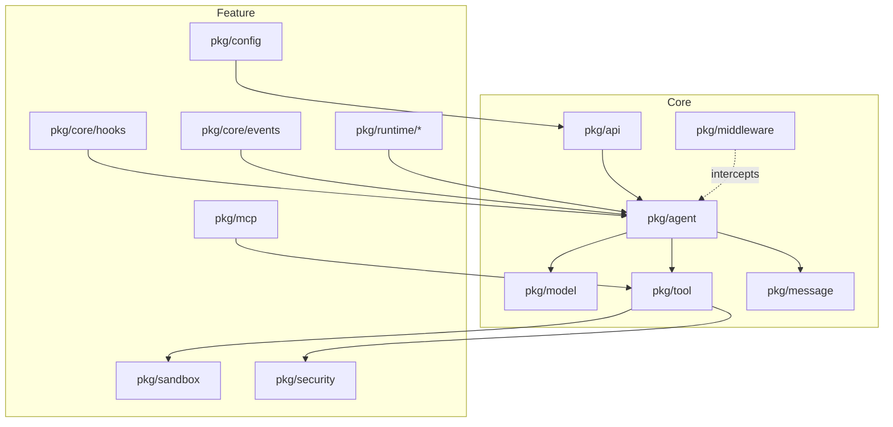

中文 | [English](README.md)

# agentsdk-go

基于 Go 语言实现的 Agent SDK，实现 Claude Code 风格的核心运行时能力，并提供可选的 Middleware 拦截机制。

## 概述

agentsdk-go 是一个模块化的 Agent 开发框架，实现 Claude Code 风格的核心运行时能力（Hooks、MCP、Sandbox、Skills、Subagents、Commands、Tasks），并在此基础上提供可选的 6 点 Middleware 拦截机制。该 SDK 支持 CLI、CI/CD 和企业平台等多种部署场景。

### 依赖

- 外部依赖：anthropic-sdk-go、fsnotify、gopkg.in/yaml.v3、google/uuid、golang.org/x/mod、golang.org/x/net

### 功能概览

- **多模型支持**：通过 `ModelFactory` 接口实现 Subagent 级别的模型绑定
- **Token 统计**：支持 Token 用量追踪与累计
- **自动 Compact**：当 Token 达到阈值时自动压缩上下文
- **异步 Bash**：后台命令执行与任务管理
- **Rules 配置**：支持 `.claude/rules/` 目录并支持热重载
- **OpenTelemetry**：分布式追踪与 span 传播
- **UUID 追踪**：请求级别的 UUID 用于可观测性

### 并发模型
- **线程安全 Runtime**：内部对可变状态加锁。
- **会话互斥**：相同 `SessionID` 的并发 `Run`/`RunStream` 会返回 `ErrConcurrentExecution`（需要串行化时由调用方自行排队/重试）。
- **关闭**：`Runtime.Close()` 等待所有进行中的请求完成。
- **验证**：修改后运行 `go test -race ./...`。

## 系统架构

### 核心层

- `pkg/agent` - Agent 执行循环，负责模型调用和工具执行的协调
- `pkg/middleware` - 6 点拦截机制，支持请求/响应生命周期的扩展
- `pkg/model` - 模型适配器，当前支持 Anthropic Claude
- `pkg/tool` - 工具注册与执行，包含内置工具和 MCP 工具支持
- `pkg/message` - 消息历史管理，基于 LRU 的会话缓存
- `pkg/api` - 统一 API 接口，对外暴露 SDK 功能

### 功能层

- `pkg/core/hooks` - Hooks 执行器，覆盖 7 类生命周期事件，支持自定义扩展
- `pkg/mcp` - MCP（Model Context Protocol）客户端，桥接外部工具（stdio/SSE）并自动注册
- `pkg/sandbox` - 沙箱隔离层，控制文件系统与网络访问策略
- `pkg/runtime/skills` - Skills 管理，支持脚本化技能装载与热更新
- `pkg/runtime/subagents` - Subagents 管理，负责多智能体的编排与调度
- `pkg/runtime/commands` - Commands 解析器，处理 Slash 命令路由与参数校验
- `pkg/runtime/tasks` - 任务追踪与依赖管理

此外，功能层还包含 `pkg/config`（配置加载/热更新）、`pkg/core/events`（事件总线）和 `pkg/security`（命令与路径校验）等支撑包。

### 架构图



### Middleware 拦截点

SDK 在请求处理的关键节点提供拦截能力：

```
用户请求
  ↓
before_agent  ← 请求验证、审计日志
  ↓
Agent 循环
  ↓
before_model  ← Prompt 处理、上下文优化
  ↓
模型调用
  ↓
after_model   ← 结果过滤、内容检查
  ↓
before_tool   ← 工具参数验证
  ↓
工具执行
  ↓
after_tool    ← 结果后处理
  ↓
after_agent   ← 响应格式化、指标采集
  ↓
用户响应
```

## 安装

### 环境要求

- Go 1.24.0 或更高版本
- Anthropic API Key（运行示例需要）

### 获取 SDK

```bash
go get github.com/cexll/agentsdk-go
```

## 快速开始

### 基础示例

```go
package main

import (
    "context"
    "log"
    "os"

    "github.com/cexll/agentsdk-go/pkg/api"
    "github.com/cexll/agentsdk-go/pkg/model"
)

func main() {
    ctx := context.Background()

    // 创建模型提供者
    provider := model.NewAnthropicProvider(
        model.WithAPIKey(os.Getenv("ANTHROPIC_API_KEY")),
        model.WithModel("claude-sonnet-4-5"),
    )

    // 初始化运行时
    runtime, err := api.New(ctx, api.Options{
        ProjectRoot:   ".",
        ModelFactory:  provider,
    })
    if err != nil {
        log.Fatal(err)
    }
    defer runtime.Close()

    // 执行任务
    result, err := runtime.Run(ctx, api.Request{
        Prompt:    "列出当前目录下的文件",
        SessionID: "demo",
    })
    if err != nil {
        log.Fatal(err)
    }

    log.Printf("输出: %s", result.Output)
}
```

### 使用 Middleware

```go
import (
    "context"
    "log"
    "time"

    "github.com/cexll/agentsdk-go/pkg/middleware"
)

// 日志中间件
loggingMiddleware := middleware.Middleware{
    BeforeAgent: func(ctx context.Context, req *middleware.AgentRequest) (*middleware.AgentRequest, error) {
        log.Printf("[REQUEST] %s", req.Input)
        req.Meta["start_time"] = time.Now()
        return req, nil
    },
    AfterAgent: func(ctx context.Context, resp *middleware.AgentResponse) (*middleware.AgentResponse, error) {
        duration := time.Since(resp.Meta["start_time"].(time.Time))
        log.Printf("[RESPONSE] %s (耗时: %v)", resp.Output, duration)
        return resp, nil
    },
}

// 注入 Middleware
runtime, err := api.New(ctx, api.Options{
    ProjectRoot:   ".",
    ModelFactory:  provider,
    Middleware:    []middleware.Middleware{loggingMiddleware},
})
if err != nil {
    log.Fatal(err)
}
defer runtime.Close()
```

### 流式输出

```go
// 使用流式 API 获取实时进度
events := runtime.RunStream(ctx, api.Request{
    Prompt:    "分析代码库结构",
    SessionID: "analysis",
})

for event := range events {
    switch event.Type {
    case "content_block_delta":
        fmt.Print(event.Delta.Text)
    case "tool_execution_start":
        fmt.Printf("\n[工具执行] %s\n", event.ToolName)
    case "tool_execution_stop":
        fmt.Printf("[工具结果] %s\n", event.Output)
    }
}
```

### 并发使用

Runtime 支持不同 `SessionID` 的并发调用；相同 `SessionID` 互斥执行。

```go
// 同一个 runtime 可以安全地从多个 goroutine 使用
runtime, _ := api.New(ctx, api.Options{
    ProjectRoot:  ".",
    ModelFactory: provider,
})
defer runtime.Close()

// 不同会话的并发请求会并行执行
var wg sync.WaitGroup
for i := 0; i < 10; i++ {
    wg.Add(1)
    go func(id int) {
        defer wg.Done()
        result, err := runtime.Run(ctx, api.Request{
            Prompt:    fmt.Sprintf("任务 %d", id),
            SessionID: fmt.Sprintf("session-%d", id), // 不同会话并发执行
        })
        if err != nil {
            log.Printf("任务 %d 失败: %v", id, err)
            return
        }
        log.Printf("任务 %d 完成: %s", id, result.Output)
    }(i)
}
wg.Wait()

// 相同 session ID 的请求需要由调用方串行化
_, _ = runtime.Run(ctx, api.Request{Prompt: "第一个", SessionID: "same"})
_, _ = runtime.Run(ctx, api.Request{Prompt: "第二个", SessionID: "same"})
```

**并发保证：**
- `Runtime` 方法可并发使用（不同会话互不影响）
- 同会话并发请求返回 `ErrConcurrentExecution`
- 不同会话请求并行执行
- `Runtime.Close()` 优雅等待所有进行中的请求
- 不同会话无需手动加锁；同会话如需排队由调用方自行处理

### 自定义工具注册

选择要加载的内置工具并追加自定义工具：

```go
rt, err := api.New(ctx, api.Options{
    ProjectRoot:         ".",
    ModelFactory:        provider,
    EnabledBuiltinTools: []string{"bash", "file_read"}, // nil=全部，空切片=禁用全部
    CustomTools:         []tool.Tool{&EchoTool{}},      // 当 Tools 为空时追加
})
if err != nil {
    log.Fatal(err)
}
defer rt.Close()
```

- `EnabledBuiltinTools`：nil→全部内置；空切片→禁用内置；非空→只启用列出的内置（大小写不敏感，下划线命名）。
- `CustomTools`：追加自定义工具；当 `Tools` 非空时被忽略。
- `Tools`：旧字段，非空时完全接管工具集（保持向后兼容）。

完整示例见 `examples/05-custom-tools`。

## 示例

仓库包含 5 个渐进式示例：
- `01-basic` - 最小化单次请求/响应
- `02-cli` - 交互式 REPL，带会话历史
- `03-http` - REST + SSE 服务器（`:8080`）
- `04-advanced` - 完整流程（middleware、hooks、MCP、sandbox、skills、subagents）
- `05-custom-tools` - 选择性内置工具 + 自定义工具注册

## 项目结构

```
agentsdk-go/
├── pkg/                        # 核心包
│   ├── agent/                  # Agent 核心循环
│   ├── middleware/             # Middleware 系统
│   ├── model/                  # 模型适配器
│   ├── tool/                   # 工具系统
│   │   └── builtin/            # 内置工具（bash、file、grep、glob）
│   ├── message/                # 消息历史管理
│   ├── api/                    # SDK 统一接口
│   ├── config/                 # 配置加载
│   ├── core/
│   │   ├── events/             # 事件总线
│   │   └── hooks/              # Hooks 执行器
│   ├── sandbox/                # 沙箱隔离
│   ├── mcp/                    # MCP 客户端
│   ├── runtime/
│   │   ├── skills/             # Skills 管理
│   │   ├── subagents/          # Subagents 管理
│   │   └── commands/           # Commands 解析
│   └── security/               # 安全工具
├── cmd/cli/                    # CLI 入口
├── examples/                   # 示例代码
│   ├── 01-basic/               # 最小化单次请求/响应
│   ├── 02-cli/                 # 交互式 REPL 带会话历史
│   ├── 03-http/                # HTTP 服务器（REST + SSE）
│   ├── 04-advanced/            # 完整流程（middleware、hooks、MCP、sandbox、skills、subagents）
│   └── 05-custom-tools/        # 自定义工具注册与选择性内置工具
├── test/integration/           # 集成测试
└── docs/                       # 文档
```

## 配置

SDK 使用 `.claude/` 目录进行配置，与 Claude Code 兼容：

```
.claude/
├── settings.json     # 项目配置
├── settings.local.json  # 本地覆盖（已加入 .gitignore）
├── skills/           # Skills 定义
├── commands/         # 斜杠命令定义
└── agents/           # Subagents 定义
```

### 配置优先级

- 运行时覆盖（最高优先级，CLI / API 提供的配置）
- `.claude/settings.local.json`
- `.claude/settings.json`
- SDK 内置默认值

`~/.claude` 已不再读取，请将全局配置迁移到项目范围的 `.claude/` 目录；原放在用户主目录的 `settings.json` / `settings.local.json` 需要复制到各项目根目录，确保加载顺序符合预期。

### 配置示例

```json
{
  "permissions": {
    "allow": ["Bash(ls:*)", "Bash(pwd:*)"],
    "deny": ["Read(.env)", "Read(secrets/**)"]
  },
  "env": {
    "MY_VAR": "value"
  },
  "sandbox": {
    "enabled": false
  }
}
```

## HTTP API

SDK 提供 HTTP 服务器实现，支持 SSE 流式推送。

### 启动服务器

```bash
export ANTHROPIC_API_KEY=sk-ant-...
cd examples/03-http
go run .
```

服务器默认监听 `:8080`，提供以下端点：

- `GET /health` - 健康检查
- `POST /v1/run` - 同步执行，返回完整结果
- `POST /v1/run/stream` - SSE 流式输出，实时返回进度

### 流式 API 示例

```bash
curl -N -X POST http://localhost:8080/v1/run/stream \
  -H 'Content-Type: application/json' \
  -d '{
    "prompt": "列出当前目录",
    "session_id": "demo"
  }'
```

响应格式遵循 Anthropic Messages API 规范，包含以下事件类型：

- `agent_start` / `agent_stop` - Agent 执行边界
- `iteration_start` / `iteration_stop` - 迭代边界
- `message_start` / `message_stop` - 消息边界
- `content_block_delta` - 文本增量输出
- `tool_execution_start` / `tool_execution_stop` - 工具执行进度

## 测试

### 运行测试

```bash
# 所有测试
go test ./...

# 核心模块测试
go test ./pkg/agent/... ./pkg/middleware/... ./pkg/model/...

# 集成测试
go test ./test/integration/...

# 生成覆盖率报告
go test -coverprofile=coverage.out ./...
go tool cover -html=coverage.out
```

### 覆盖率

覆盖率会随代码变化；请使用 `go test -coverprofile=coverage.out ./...` 生成报告。

## 构建

### Makefile 命令

```bash
# 运行测试
make test

# 生成覆盖率报告
make coverage

# 代码检查
make lint

# 构建 CLI 工具
make agentctl

# 安装到 GOPATH
make install

# 清理构建产物
make clean
```

## 内置工具

SDK 包含以下内置工具：

### 核心工具（位于 `pkg/tool/builtin/`）
- `bash` - 执行 shell 命令，支持工作目录和超时配置
- `file_read` - 读取文件内容，支持 offset/limit
- `file_write` - 写入文件内容（创建或覆盖）
- `file_edit` - 编辑文件，字符串替换
- `grep` - 正则搜索，支持递归和文件过滤
- `glob` - 文件模式匹配，支持多个模式

### 扩展工具
- `web_fetch` - 获取 Web 内容，基于提示词提取
- `web_search` - Web 搜索，支持域名过滤
- `bash_output` - 读取后台 bash 进程输出
- `bash_status` - 轮询后台 bash 进程状态
- `kill_task` - 终止运行中的后台 bash 任务
- `task_create` - 创建新任务
- `task_list` - 列出任务
- `task_get` - 按 ID 获取任务
- `task_update` - 更新任务状态与依赖关系
- `ask_user_question` - 在执行过程中向用户提问
- `skill` - 执行 `.claude/skills/` 中的技能
- `slash_command` - 执行 `.claude/commands/` 中的斜杠命令
- `task` - 生成子代理处理复杂任务（仅 CLI/Platform 入口点）

所有内置工具遵循沙箱策略，受路径白名单和命令验证器约束。使用 `EnabledBuiltinTools` 选择性启用工具，或使用 `CustomTools` 注册自定义实现。

## 安全机制

### 三层防御

1. **路径白名单**：限制文件系统访问范围
2. **符号链接解析**：防止路径遍历攻击
3. **命令验证**：阻止危险命令执行

### 命令验证器

位于 `pkg/security/validator.go`，默认阻止以下操作：

- 破坏性命令：`dd`、`mkfs`、`fdisk`、`shutdown`、`reboot`
- 危险删除模式：`rm -rf`、`rm -r`、`rmdir -p`
- Shell 元字符：`|`、`;`、`&`、`>`、`<`、`` ` ``（在 Platform 模式下）

## 开发指南

### 添加自定义工具

实现 `tool.Tool` 接口：

```go
type CustomTool struct{}

func (t *CustomTool) Name() string {
    return "custom_tool"
}

func (t *CustomTool) Description() string {
    return "工具描述"
}

func (t *CustomTool) Schema() *tool.JSONSchema {
    return &tool.JSONSchema{
        Type: "object",
        Properties: map[string]interface{}{
            "param": map[string]interface{}{
                "type": "string",
                "description": "参数说明",
            },
        },
        Required: []string{"param"},
    }
}

func (t *CustomTool) Execute(ctx context.Context, params map[string]any) (*tool.ToolResult, error) {
    // 工具实现
    return &tool.ToolResult{
        Name:   t.Name(),
        Output: "执行结果",
    }, nil
}
```

### 添加 Middleware

```go
customMiddleware := middleware.Middleware{
    BeforeAgent: func(ctx context.Context, req *middleware.AgentRequest) (*middleware.AgentRequest, error) {
        // 请求前处理
        return req, nil
    },
    AfterAgent: func(ctx context.Context, resp *middleware.AgentResponse) (*middleware.AgentResponse, error) {
        // 响应后处理
        return resp, nil
    },
    BeforeModel: func(ctx context.Context, msgs []message.Message) ([]message.Message, error) {
        // 模型调用前处理
        return msgs, nil
    },
    AfterModel: func(ctx context.Context, output *agent.ModelOutput) (*agent.ModelOutput, error) {
        // 模型调用后处理
        return output, nil
    },
    BeforeTool: func(ctx context.Context, call *middleware.ToolCall) (*middleware.ToolCall, error) {
        // 工具执行前处理
        return call, nil
    },
    AfterTool: func(ctx context.Context, result *middleware.ToolResult) (*middleware.ToolResult, error) {
        // 工具执行后处理
        return result, nil
    },
}
```

## 设计原则

### KISS（Keep It Simple, Stupid）

- 单一职责，每个模块功能明确
- 避免过度设计和不必要的抽象

### 配置驱动

- 通过 `.claude/` 目录管理所有配置
- 支持热更新，无需重启服务
- 声明式配置优于命令式代码

### 模块化

- 多个独立包，松耦合设计
- 清晰的接口边界
- 易于测试和维护

### 可扩展性

- Middleware 机制支持灵活扩展
- 工具系统支持自定义工具注册
- MCP 协议支持外部工具集成

## 文档

- [架构文档](docs/architecture.md) - 详细架构分析
- [入门指南](docs/getting-started.md) - 分步教程
- [API 参考](docs/api-reference.md) - API 文档
- [安全实践](docs/security.md) - 安全配置指南
- [自定义工具指南](docs/custom-tools-guide.md) - 自定义工具注册与使用
- [HTTP API 指南](examples/03-http/README.md) - HTTP 服务器使用说明
- [开发计划](.claude/specs/claude-code-rewrite/dev-plan.md) - 架构设计计划
- [完成报告](.claude/specs/claude-code-rewrite/COMPLETION_REPORT.md) - 实现报告

## 技术栈

- Go 1.24.0+
- [anthropic-sdk-go](https://github.com/anthropics/anthropic-sdk-go) - Anthropic 官方 SDK
- [modelcontextprotocol/go-sdk](https://github.com/modelcontextprotocol/go-sdk) - 官方 MCP SDK
- [fsnotify](https://github.com/fsnotify/fsnotify) - 文件系统监控
- [yaml.v3](https://gopkg.in/yaml.v3) - YAML 解析
- [google/uuid](https://github.com/google/uuid) - UUID 工具
- [golang.org/x/mod](https://pkg.go.dev/golang.org/x/mod) - 模块工具
- [golang.org/x/net](https://pkg.go.dev/golang.org/x/net) - 扩展网络包

## 许可证

详见 [LICENSE](LICENSE) 文件。
